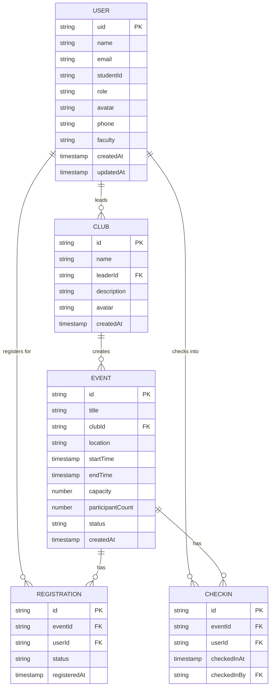

# Design Document: Code Structure Refactor

## Overview

This design refactors the university event management app to follow Flutter and Firebase best practices. The refactor introduces proper model abstractions for registrations, check-ins, and clubs, renames collections to follow consistent naming conventions, and establishes a clean service layer architecture. The design maintains backward compatibility during migration and prepares the codebase for future features like QR-based attendance tracking.

### Goals

- Establish type-safe model classes for all data entities
- Rename `eventRegistrations` collection to `registrations` following Firebase conventions
- Separate registration (intent to attend) from check-in (actual attendance)
- Prepare data structure for QR-based check-in feature
- Maintain backward compatibility during migration
- Eliminate raw Map usage in service layer

### Non-Goals

- Implementing QR code generation or scanning (future feature)
- Migrating existing UI components (maintain existing interfaces)
- Changing authentication or authorization logic
- Modifying notification system architecture

## Architecture

### Current Architecture Issues

1. **Inconsistent Collection Naming**: `eventRegistrations` uses camelCase instead of snake_case
2. **Missing Model Abstractions**: Registration data handled as raw maps
3. **Tight Coupling**: Services directly manipulate Map<String, dynamic> structures
4. **No Separation**: Registration and attendance tracking conflated in single concept
5. **Club Data Embedded**: Club information stored within UserModel instead of separate entity

### Proposed Architecture

```
┌─────────────────────────────────────────────────────────────┐
│                        UI Layer                              │
│  (Screens, Widgets - No changes to existing interfaces)     │
└─────────────────────────────────────────────────────────────┘
                            │
                            ▼
┌─────────────────────────────────────────────────────────────┐
│                      Service Layer                           │
│  ┌──────────────┐  ┌──────────────┐  ┌──────────────┐     │
│  │ EventService │  │  AuthService │  │NotificationSvc│     │
│  │              │  │              │  │              │     │
│  │ Uses Models  │  │              │  │              │     │
│  └──────────────┘  └──────────────┘  └──────────────┘     │
└─────────────────────────────────────────────────────────────┘
                            │
                            ▼
┌─────────────────────────────────────────────────────────────┐
│                       Model Layer                            │
│  ┌──────────────┐  ┌──────────────┐  ┌──────────────┐     │
│  │Registration  │  │  CheckIn     │  │    Club      │     │
│  │   Model      │  │   Model      │  │   Model      │     │
│  └──────────────┘  └──────────────┘  └──────────────┘     │
│  ┌──────────────┐  ┌──────────────┐                        │
│  │    Event     │  │  UserModel   │                        │
│  │   (existing) │  │  (existing)  │                        │
│  └──────────────┘  └──────────────┘                        │
└─────────────────────────────────────────────────────────────┘
                            │
                            ▼
┌─────────────────────────────────────────────────────────────┐
│                    Firebase Firestore                        │
│  ┌──────────────┐  ┌──────────────┐  ┌──────────────┐     │
│  │ registrations│  │   checkins   │  │    clubs     │     │
│  └──────────────┘  └──────────────┘  └──────────────┘     │
│  ┌──────────────┐  ┌──────────────┐  ┌──────────────┐     │
│  │    events    │  │    users     │  │notifications │     │
│  └──────────────┘  └──────────────┘  └──────────────┘     │
└─────────────────────────────────────────────────────────────┘
```

### Layered Responsibilities

**UI Layer**: Displays data and captures user interactions. No changes to existing screens.

**Service Layer**: Business logic, data access, and Firestore operations. Updated to use model classes instead of raw maps.

**Model Layer**: Type-safe data structures with serialization/deserialization logic. New models added for Registration, CheckIn, and Club.

**Data Layer**: Firebase Firestore collections with consistent naming and clear schema.

## Components and Interfaces

### RegistrationModel

Represents a user's registration for an event (intent to attend).

```dart
class RegistrationModel {
  final String id;
  final String eventId;
  final String userId;
  final String status;  // 'registered', 'cancelled', 'waitlist'
  final DateTime registeredAt;

  RegistrationModel({
    required this.id,
    required this.eventId,
    required this.userId,
    required this.status,
    required this.registeredAt,
  });

  factory RegistrationModel.fromFirestore(Map<String, dynamic> data, String id);
  Map<String, dynamic> toMap();
}
```

**Fields**:
- `id`: Firestore document ID
- `eventId`: Reference to events collection
- `userId`: Reference to users collection
- `status`: Registration state (registered, cancelled, waitlist)
- `registeredAt`: Timestamp when user registered

**Methods**:
- `fromFirestore`: Deserializes Firestore document, converts Timestamp to DateTime
- `toMap`: Serializes to Firestore-compatible map, converts DateTime to Timestamp

### CheckInModel

Represents a user's physical attendance at an event (actual attendance).

```dart
class CheckInModel {
  final String id;
  final String eventId;
  final String userId;
  final DateTime checkedInAt;
  final String? checkedInBy;  // Optional: staff member who checked in user

  CheckInModel({
    required this.id,
    required this.eventId,
    required this.userId,
    required this.checkedInAt,
    this.checkedInBy,
  });

  factory CheckInModel.fromFirestore(Map<String, dynamic> data, String id);
  Map<String, dynamic> toMap();
}
```

**Fields**:
- `id`: Firestore document ID
- `eventId`: Reference to events collection
- `userId`: Reference to users collection
- `checkedInAt`: Timestamp when user checked in
- `checkedInBy`: Optional user ID of staff who performed check-in (null for QR self-check-in)

**Methods**:
- `fromFirestore`: Deserializes Firestore document, converts Timestamp to DateTime
- `toMap`: Serializes to Firestore-compatible map, converts DateTime to Timestamp

**Future QR Integration**: The model is prepared to store QR validation data. Future fields may include:
- `qrCode`: The QR code value that was scanned
- `validationMethod`: 'qr_scan' | 'manual' | 'staff'

### ClubModel

Represents a student club/organization that creates events.

```dart
class ClubModel {
  final String id;
  final String name;
  final String description;
  final String leaderId;
  final String history;
  final String introduction;
  final String? avatar;
  final DateTime createdAt;
  final DateTime updatedAt;

  ClubModel({
    required this.id,
    required this.name,
    required this.description,
    required this.leaderId,
    required this.history,
    required this.introduction,
    this.avatar,
    required this.createdAt,
    required this.updatedAt,
  });

  factory ClubModel.fromFirestore(Map<String, dynamic> data, String id);
  Map<String, dynamic> toMap();
}
```

**Fields**:
- `id`: Firestore document ID
- `name`: Club name
- `description`: Short description
- `leaderId`: Reference to users collection (club leader)
- `history`: Club history text
- `introduction`: Club introduction text
- `avatar`: Optional club logo/avatar URL
- `createdAt`: Club creation timestamp
- `updatedAt`: Last update timestamp

**Methods**:
- `fromFirestore`: Deserializes Firestore document, converts Timestamp to DateTime
- `toMap`: Serializes to Firestore-compatible map, converts DateTime to Timestamp

**Note**: Currently, club data may be embedded in UserModel. This design separates club data into its own collection for better scalability and data independence.

### EventService Updates

The EventService will be updated to use the new model classes while maintaining existing method signatures.

**Updated Methods**:

```dart
class EventService {
  // Registration methods updated to use RegistrationModel
  Future<void> registerForEvent(String eventId);
  Future<void> unregisterFromEvent(String eventId);
  Stream<bool> isRegisteredStream(String eventId);
  Stream<List<Event>> getRegisteredEvents();
  
  // New helper methods using models
  Future<RegistrationModel?> _getRegistration(String eventId, String userId);
  Future<List<RegistrationModel>> _getEventRegistrations(String eventId);
  
  // Future check-in methods (prepared but not implemented)
  // Future<void> checkInUser(String eventId, String userId, {String? checkedInBy});
  // Stream<bool> isCheckedInStream(String eventId);
}
```

**Key Changes**:
- Replace `_db.collection('eventRegistrations')` with `_db.collection('registrations')`
- Use `RegistrationModel.fromFirestore()` when reading registration data
- Use `RegistrationModel(...).toMap()` when writing registration data
- Add backward compatibility reads during migration period
- Maintain existing method signatures to avoid breaking UI code

## Data Models

### Firestore Collection Structure

```
firestore/
├── users/
│   └── {userId}/
│       ├── uid: string
│       ├── name: string
│       ├── email: string
│       ├── studentId: string
│       ├── role: string
│       ├── avatar: string?
│       ├── phone: string?
│       ├── faculty: string?
│       ├── createdAt: Timestamp
│       └── updatedAt: Timestamp
│
├── events/
│   └── {eventId}/
│       ├── title: string
│       ├── description: string
│       ├── clubId: string
│       ├── location: string
│       ├── startTime: Timestamp
│       ├── endTime: Timestamp
│       ├── capacity: number
│       ├── participantCount: number
│       ├── image: string
│       ├── createdBy: string
│       ├── createdAt: Timestamp
│       ├── updatedAt: Timestamp
│       ├── status: string
│       └── note: string
│
├── registrations/  ← NEW (renamed from eventRegistrations)
│   └── {registrationId}/
│       ├── eventId: string (indexed)
│       ├── userId: string (indexed)
│       ├── status: string
│       └── registeredAt: Timestamp
│
├── checkins/  ← NEW (future feature)
│   └── {checkinId}/
│       ├── eventId: string (indexed)
│       ├── userId: string (indexed)
│       ├── checkedInAt: Timestamp
│       └── checkedInBy: string?
│
├── clubs/  ← NEW (optional, if separating from users)
│   └── {clubId}/
│       ├── name: string
│       ├── description: string
│       ├── leaderId: string
│       ├── history: string
│       ├── introduction: string
│       ├── avatar: string?
│       ├── createdAt: Timestamp
│       └── updatedAt: Timestamp
│
├── user_notifications/
│   └── {notificationId}/
│       ├── userId: string (indexed)
│       ├── eventId: string
│       ├── eventTitle: string
│       ├── type: string
│       ├── message: string
│       ├── isRead: boolean
│       └── createdAt: Timestamp
│
└── notifications/
    └── {notificationId}/
        ├── title: string
        ├── body: string
        ├── topic: string
        ├── eventId: string
        ├── eventName: string
        ├── type: string
        └── createdAt: Timestamp
```

### Collection Naming Conventions

- **Plural nouns**: `users`, `events`, `registrations`, `checkins`, `clubs`
- **Snake_case for multi-word**: `user_notifications` (not `userNotifications`)
- **Descriptive**: Collection name clearly indicates content
- **Consistent**: All collections follow same pattern

### Indexes Required

**registrations collection**:
- Composite index: `(eventId, userId)` - for checking if user is registered
- Single field index: `userId` - for querying user's registrations
- Single field index: `eventId` - for querying event's registrations

**checkins collection** (future):
- Composite index: `(eventId, userId)` - for checking if user checked in
- Single field index: `userId` - for querying user's check-ins
- Single field index: `eventId` - for querying event's check-ins

### Data Relationships



### Registration vs Check-In Separation

**Registration** (intent to attend):
- Created when user clicks "Register" button
- Indicates user plans to attend
- Used for capacity management
- Used for sending event notifications
- Can be cancelled before event

**Check-In** (actual attendance):
- Created when user arrives at event (future feature)
- Indicates user physically attended
- Used for attendance tracking
- Used for attendance reports
- Cannot be undone (permanent record)

**Why Separate?**:
1. **Different lifecycles**: Registration happens days before, check-in happens at event
2. **Different purposes**: Registration for planning, check-in for verification
3. **Data integrity**: Attendance records should be immutable
4. **Analytics**: Can compare registration vs attendance rates
5. **QR codes**: Check-in will use QR validation, registration doesn't

## Correctness Properties

*A property is a characteristic or behavior that should hold true across all valid executions of a system-essentially, a formal statement about what the system should do. Properties serve as the bridge between human-readable specifications and machine-verifiable correctness guarantees.*

