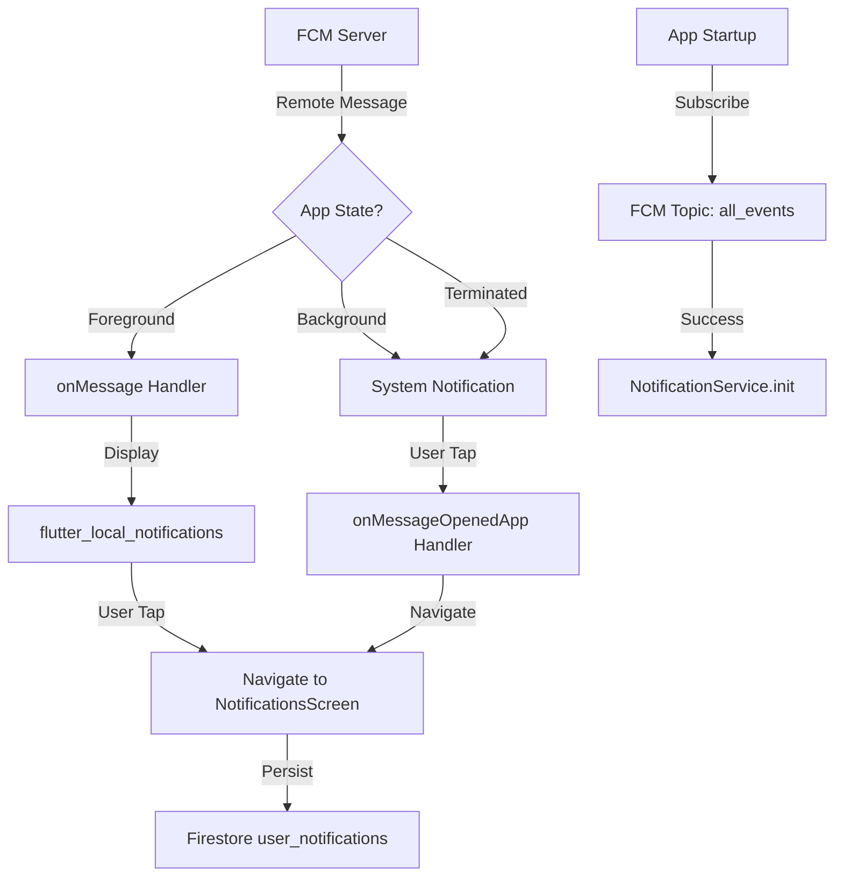

# Design Document: Firebase Cloud Messaging for Event Update Notifications

## Overview

This design specifies the technical implementation for integrating Firebase Cloud Messaging (FCM) into the UniEvents Flutter application. The system will deliver push notifications to users when club administrators modify events, handling three distinct application states: foreground (app active), background (app minimized), and terminated (app closed).

The implementation extends the existing `NotificationService` class and integrates with the current Firestore-based notification system. The design leverages two key packages: `firebase_messaging` (v16.1.2, already installed) for FCM functionality and `flutter_local_notifications` (v17.0.0, to be added) for foreground notification display.

### Key Design Goals

1. Seamless notification delivery across all app states
2. Consistent user experience with platform-appropriate notification styling
3. Integration with existing notification persistence in Firestore
4. Minimal disruption to current codebase architecture
5. Proper error handling and logging for debugging

## Architecture

### System Components

The notification system consists of four primary components:

1. **FCM Message Handler**: Receives and routes incoming messages based on app state
2. **Foreground Notification Manager**: Displays local notifications when app is active
3. **Topic Subscription Manager**: Manages subscription to the "all_events" topic
4. **Notification State Synchronizer**: Ensures FCM notifications are persisted to Firestore

### Component Interaction Flow



### State-Based Message Handling

The system handles three distinct app states:

**Foreground State**: 
- FCM delivers message to `FirebaseMessaging.onMessage` stream
- App displays notification using `flutter_local_notifications`
- User can tap notification to navigate to NotificationsScreen
- Notification is immediately persisted to Firestore

**Background State**:
- FCM automatically displays system notification
- No custom handling required for display
- `onMessageOpenedApp` handler processes user tap
- App opens and navigates to NotificationsScreen

**Terminated State**:
- FCM automatically displays system notification
- Background message handler logs the event
- `getInitialMessage` retrieves notification that launched app
- App navigates to NotificationsScreen after initialization

## Components and Interfaces

### Enhanced NotificationService

The existing `NotificationService` class will be extended with foreground notification handling capabilities.

**New Dependencies**:
```dart
import 'package:flutter_local_notifications/flutter_local_notifications.dart';
```

**New Instance Variables**:
```dart
final FlutterLocalNotificationsPlugin _localNotifications = 
    FlutterLocalNotificationsPlugin();
```

**Modified Methods**:

`init()` - Enhanced to:
- Initialize `flutter_local_notifications` plugin
- Configure Android notification channel
- Configure iOS notification settings
- Set up foreground message listener
- Set up notification tap handlers
- Subscribe to "all_events" topic

**New Methods**:

`_initializeLocalNotifications()` - Configures local notification plugin:
- Creates Android notification channel with high importance
- Requests iOS notification permissions
- Registers notification tap callback

`_setupForegroundMessageHandler()` - Listens to `FirebaseMessaging.onMessage`:
- Extracts title and body from RemoteMessage
- Displays local notification using platform-specific styling
- Logs notification receipt

`_setupNotificationTapHandler()` - Handles notification taps:
- Receives notification payload
- Navigates to NotificationsScreen
- Persists notification to Firestore

`_showLocalNotification(RemoteMessage message)` - Displays foreground notification:
- Extracts notification data from RemoteMessage
- Creates platform-specific notification details
- Shows notification with unique ID

`createNotificationRecord(RemoteMessage message)` - Persists to Firestore:
- Extracts event data from message payload
- Creates document in `user_notifications` collection
- Sets initial `isRead: false` state

### Background Message Handler

A top-level function registered before app initialization.

**Function Signature**:
```dart
@pragma('vm:entry-point')
Future<void> _firebaseMessagingBackgroundHandler(RemoteMessage message)
```

**Responsibilities**:
- Log background message receipt
- No display logic (handled automatically by FCM)
- Must be a top-level function (not a class method)

### Main App Initialization

The `main()` function orchestrates FCM setup.

**Initialization Sequence**:
1. `WidgetsFlutterBinding.ensureInitialized()`
2. `Firebase.initializeApp()`
3. `FirebaseMessaging.onBackgroundMessage()` registration
4. `runApp()`

### Navigation Integration

**NotificationsScreen Navigation**:
- Existing screen at `lib/screens/notification/notifications_screen.dart`
- No modifications required to screen itself
- Navigation triggered by notification tap handlers
- Uses `Navigator.push()` with MaterialPageRoute

## Data Models

### RemoteMessage Structure

FCM delivers messages as `RemoteMessage` objects with the following structure:

```dart
RemoteMessage {
  messageId: String,
  notification: RemoteNotification? {
    title: String?,
    body: String?
  },
  data: Map<String, dynamic> {
    'eventId': String,
    'eventName': String,
    'type': String, // 'event_cancelled', 'event_updated', etc.
  }
}
```

### Notification Payload Format

**Event Cancelled**:
```json
{
  "notification": {
    "title": "📢 Event Cancelled",
    "body": "{event_name} has been cancelled"
  },
  "data": {
    "eventId": "event_123",
    "eventName": "Tech Workshop",
    "type": "event_cancelled"
  }
}
```

**Event Updated**:
```json
{
  "notification": {
    "title": "📢 Event Updated",
    "body": "{event_name} has been modified"
  },
  "data": {
    "eventId": "event_123",
    "eventName": "Tech Workshop",
    "type": "event_updated"
  }
}
```

**Event Deleted**:
```json
{
  "notification": {
    "title": "📢 Event Deleted",
    "body": "{event_name} has been removed"
  },
  "data": {
    "eventId": "event_123",
    "eventName": "Tech Workshop",
    "type": "event_deleted"
  }
}
```

**Event Reactivated**:
```json
{
  "notification": {
    "title": "📢 Event Reactivated",
    "body": "{event_name} is now active again"
  },
  "data": {
    "eventId": "event_123",
    "eventName": "Tech Workshop",
    "type": "event_reactivated"
  }
}
```

### Firestore Notification Document

Notifications persisted to `user_notifications` collection:

```dart
{
  'userId': String,           // Current user's UID
  'eventId': String,          // From message.data
  'eventTitle': String,       // From message.data['eventName']
  'type': String,             // From message.data['type']
  'message': String,          // From message.notification.body
  'isRead': bool,             // Initially false
  'createdAt': Timestamp      // Server timestamp
}
```

### Android Notification Channel

Required for Android 8.0+ notification display:

```dart
AndroidNotificationChannel(
  id: 'high_importance_channel',
  name: 'Event Notifications',
  description: 'Notifications for event updates',
  importance: Importance.high,
  playSound: true,
  enableVibration: true
)
```

### iOS Notification Configuration

```dart
DarwinInitializationSettings(
  requestAlertPermission: true,
  requestBadgePermission: true,
  requestSoundPermission: true
)
```


## Correctness Properties

*A property is a characteristic or behavior that should hold true across all valid executions of a system-essentially, a formal statement about what the system should do. Properties serve as the bridge between human-readable specifications and machine-verifiable correctness guarantees.*

### Property 1: Foreground Message Display

*For any* RemoteMessage received while the app is in foreground state, the system shall display a local notification containing both the message title and body extracted from the RemoteMessage.

**Validates: Requirements 2.1, 2.2, 2.3, 2.4**

### Property 2: Event Notification Format Validation

*For any* event notification message, the message format shall match the event type: cancelled events shall have title "📢 Event Cancelled" and body "{event_name} has been cancelled", updated events shall have title "📢 Event Updated" and body "{event_name} has been modified", deleted events shall have title "📢 Event Deleted" and body "{event_name} has been removed", and reactivated events shall have title "📢 Event Reactivated" and body "{event_name} is now active again", where {event_name} is the actual event name.

**Validates: Requirements 4.1, 4.2, 4.3, 4.4, 4.5**

### Property 3: Comprehensive Message Logging

*For any* RemoteMessage received, the system shall log the message ID; additionally, for foreground messages the system shall log the notification title, for background messages the system shall log "Handling a background message: {message_id}", and for any error during processing the system shall log the error details.

**Validates: Requirements 7.1, 7.2, 7.3, 7.4**

### Property 4: Notification Tap Navigation

*For any* notification tap event, the system shall navigate to the NotificationsScreen.

**Validates: Requirements 8.1**

### Property 5: FCM to Firestore Persistence

*For any* notification received via FCM, a corresponding record shall be created in the user's notification collection in Firestore with the notification data passed to the NotificationService.

**Validates: Requirements 8.2, 8.3, 8.4**

## Error Handling

### Permission Denial

**Scenario**: User denies notification permission

**Handling**:
- Log the denial with `print('User declined or has not accepted permission')`
- Continue app initialization without throwing exception
- FCM token will not be generated
- Topic subscription will not occur
- App remains functional for all non-notification features

**Recovery**: User can grant permission later through device settings; app will request permission again on next launch

### Topic Subscription Failure

**Scenario**: Network error or FCM service unavailable during topic subscription

**Handling**:
- Log the error with details
- Do not block app initialization
- Subscription will be retried on next app launch when `init()` is called again

**Recovery**: Automatic retry on next app startup

### Message Processing Errors

**Scenario**: Malformed RemoteMessage or missing required fields

**Handling**:
- Wrap message processing in try-catch blocks
- Log error details including message ID and exception
- Display generic notification if title/body are missing
- Continue processing subsequent messages

**Recovery**: Each message is processed independently; one failure doesn't affect others

### Local Notification Display Failure

**Scenario**: `flutter_local_notifications` plugin fails to display notification

**Handling**:
- Log the error with exception details
- Message is still persisted to Firestore
- User can view notification in NotificationsScreen

**Recovery**: Notification remains accessible through in-app notification list

### Firestore Persistence Failure

**Scenario**: Network error or Firestore unavailable when creating notification record

**Handling**:
- Log the error with details
- Notification was still displayed to user
- Retry logic handled by Firestore SDK

**Recovery**: Firestore SDK will retry automatically; if persistent failure, notification exists in system tray but not in app history

### Background Handler Initialization Failure

**Scenario**: Background message handler not registered before app initialization

**Handling**:
- This is a critical error that should be caught during development
- Background messages will not be logged
- System notifications will still display (handled by FCM)

**Prevention**: Ensure `FirebaseMessaging.onBackgroundMessage()` is called in `main()` before `runApp()`

## Testing Strategy

### Dual Testing Approach

This feature requires both unit testing and property-based testing to ensure comprehensive coverage:

- **Unit tests**: Verify specific examples, edge cases, and error conditions
- **Property tests**: Verify universal properties across all inputs
- Together they provide comprehensive coverage where unit tests catch concrete bugs and property tests verify general correctness

### Unit Testing

Unit tests will focus on:

**Initialization Tests**:
- Verify `init()` calls `subscribeToTopic('all_events')`
- Verify local notifications plugin is initialized
- Verify foreground message listener is set up
- Verify permission request is made
- Test permission denial scenario logs correctly
- Test subscription failure logs error

**Message Extraction Tests**:
- Test extracting title from RemoteMessage with valid notification
- Test extracting body from RemoteMessage with valid notification
- Test handling RemoteMessage with null notification
- Test handling RemoteMessage with missing title or body

**Navigation Tests**:
- Test notification tap triggers navigation to NotificationsScreen
- Test navigation with valid notification payload
- Test navigation with null payload

**Firestore Persistence Tests**:
- Test `createNotificationRecord()` creates document with correct fields
- Test document includes userId, eventId, eventTitle, type, message, isRead, createdAt
- Test handling of missing user authentication

**Error Handling Tests**:
- Test error logging when message processing fails
- Test error logging when Firestore write fails
- Test error logging when local notification display fails

### Property-Based Testing

Property-based tests will use the `test` package with custom generators. Each test will run a minimum of 100 iterations.

**Testing Library**: Dart's built-in `test` package with custom random data generators

**Property Test Configuration**:
- Minimum 100 iterations per test
- Each test tagged with comment referencing design property
- Tag format: `// Feature: firebase-event-notifications, Property {number}: {property_text}`

**Property 1: Foreground Message Display**
```dart
// Feature: firebase-event-notifications, Property 1: For any RemoteMessage received while the app is in foreground state, the system shall display a local notification containing both the message title and body extracted from the RemoteMessage.

test('Property 1: Foreground messages display local notifications', () async {
  for (int i = 0; i < 100; i++) {
    // Generate random RemoteMessage with title and body
    // Call foreground message handler
    // Verify local notification was shown with correct title and body
  }
});
```

**Property 2: Event Notification Format Validation**
```dart
// Feature: firebase-event-notifications, Property 2: For any event notification message, the message format shall match the event type

test('Property 2: Event notification formats are correct', () async {
  for (int i = 0; i < 100; i++) {
    // Generate random event type (cancelled, updated, deleted, reactivated)
    // Generate random event name
    // Create RemoteMessage for that event type
    // Verify title and body match expected format with event name
  }
});
```

**Property 3: Comprehensive Message Logging**
```dart
// Feature: firebase-event-notifications, Property 3: For any RemoteMessage received, the system shall log the message ID

test('Property 3: All messages are logged correctly', () async {
  for (int i = 0; i < 100; i++) {
    // Generate random RemoteMessage with random state (foreground/background)
    // Process message
    // Verify message ID was logged
    // If foreground, verify title was logged
    // If background, verify background message format was logged
  }
});
```

**Property 4: Notification Tap Navigation**
```dart
// Feature: firebase-event-notifications, Property 4: For any notification tap event, the system shall navigate to the NotificationsScreen

test('Property 4: Notification taps navigate correctly', () async {
  for (int i = 0; i < 100; i++) {
    // Generate random notification payload
    // Simulate notification tap
    // Verify navigation to NotificationsScreen was triggered
  }
});
```

**Property 5: FCM to Firestore Persistence**
```dart
// Feature: firebase-event-notifications, Property 5: For any notification received via FCM, a corresponding record shall be created in Firestore

test('Property 5: FCM notifications persist to Firestore', () async {
  for (int i = 0; i < 100; i++) {
    // Generate random RemoteMessage with event data
    // Process notification
    // Verify Firestore document was created
    // Verify document contains all required fields
    // Verify isRead is initially false
  }
});
```

### Integration Testing

Integration tests will verify:

- End-to-end flow from FCM message receipt to Firestore persistence
- Actual navigation to NotificationsScreen
- Interaction between NotificationService and Firestore
- Background message handler execution
- Permission request flow on actual devices

### Manual Testing Checklist

- [ ] Send test notification from Firebase Console to "all_events" topic
- [ ] Verify notification displays when app is in foreground
- [ ] Verify notification displays when app is in background
- [ ] Verify notification displays when app is terminated
- [ ] Tap notification and verify navigation to NotificationsScreen
- [ ] Verify notification appears in NotificationsScreen list
- [ ] Verify notification is marked as read when tapped
- [ ] Test on both Android and iOS devices
- [ ] Test permission denial flow
- [ ] Verify all four event types (cancelled, updated, deleted, reactivated) display correctly

### Test Data Generators

Custom generators for property-based testing:

**RemoteMessage Generator**:
```dart
RemoteMessage generateRandomRemoteMessage({
  required String eventType, // 'event_cancelled', 'event_updated', etc.
  String? eventName,
  String? messageId,
}) {
  eventName ??= 'Event ${Random().nextInt(1000)}';
  messageId ??= 'msg_${Random().nextInt(100000)}';
  
  String title, body;
  switch (eventType) {
    case 'event_cancelled':
      title = '📢 Event Cancelled';
      body = '$eventName has been cancelled';
      break;
    case 'event_updated':
      title = '📢 Event Updated';
      body = '$eventName has been modified';
      break;
    case 'event_deleted':
      title = '📢 Event Deleted';
      body = '$eventName has been removed';
      break;
    case 'event_reactivated':
      title = '📢 Event Reactivated';
      body = '$eventName is now active again';
      break;
    default:
      title = 'Event Notification';
      body = 'Event update';
  }
  
  return RemoteMessage(
    messageId: messageId,
    notification: RemoteNotification(title: title, body: body),
    data: {
      'eventId': 'event_${Random().nextInt(1000)}',
      'eventName': eventName,
      'type': eventType,
    },
  );
}
```

**Event Type Generator**:
```dart
String generateRandomEventType() {
  final types = [
    'event_cancelled',
    'event_updated',
    'event_deleted',
    'event_reactivated',
  ];
  return types[Random().nextInt(types.length)];
}
```

